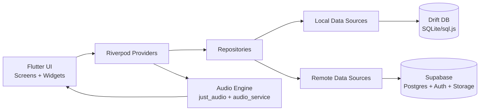
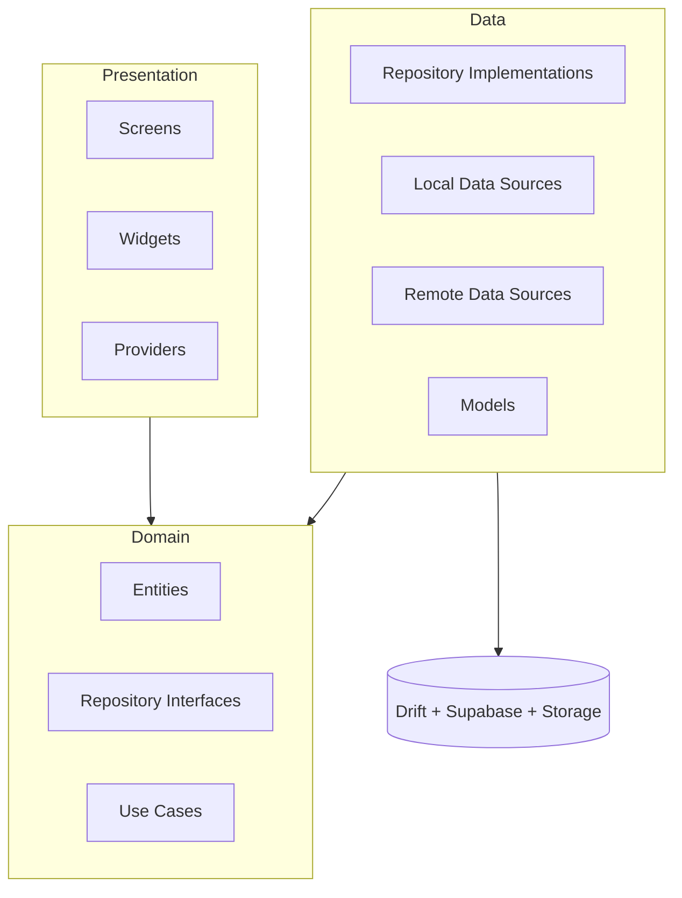
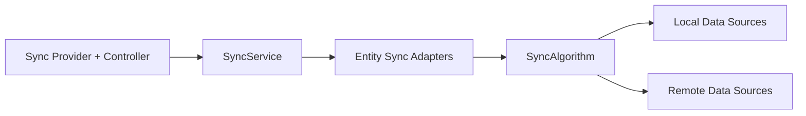

# Repertoire Coach - Technical Architecture

## Technology Stack

### Frontend Framework
- **Flutter**: Primary development framework
  - Single codebase for Android, iOS, and Web
  - Excellent performance for audio applications
  - Rich ecosystem of audio packages
  - Native compilation for mobile platforms
  - Web compilation for desktop browser access

### Platform-Specific Development
- **Native Android (Kotlin/Java)**: For Android Auto integration
  - MediaBrowserService implementation
  - Android Auto UI adaptation
  - Flutter platform channels for communication

### Backend Services
- **Supabase** (open-source Firebase alternative):
  - **PostgreSQL Database**: Relational database for all app data
  - **Supabase Auth**: User authentication and identity management
  - **Real-time Subscriptions**: PostgreSQL changes streamed to clients
  - **Row Level Security (RLS)**: Database-level access control for choir-based permissions
  - **Auto-generated APIs**: REST and GraphQL APIs from database schema
  - **Edge Functions**: Deno-based serverless functions (used for R2 audio signing)
- **Cloudflare R2**: Private object storage for audio files (S3-compatible). Access is
  gated by the `audio-signer` Edge Function which verifies Supabase JWT and choir
  membership before issuing short-lived presigned URLs.

**Why Supabase:**
- Open source (can self-host if needed, no vendor lock-in)
- PostgreSQL provides relational model with foreign keys and complex queries
- More cost-effective at scale than Firebase
- Real-time capabilities similar to Firestore
- Good Flutter support via official `supabase_flutter` package
- Row Level Security maps well to choir-based access control

### Audio Playback
- **just_audio** package (recommended):
  - Cross-platform audio playback
  - Seeking, looping, position tracking
  - Background audio support
  - Good performance with large files

Alternative: **audioplayers** package

### State Management
- **Riverpod** (recommended):
  - Modern, compile-safe state management
  - Easy testing
  - Good performance
  - Provider pattern evolution

Alternatives: Provider, Bloc, GetX

### Internationalization (i18n)
- **Flutter intl** / **flutter_localizations**:
  - Built-in Flutter localization support
  - ARB (Application Resource Bundle) files for translations
  - Type-safe message access
  - Compile-time validation of translation keys
  - Supports plurals, genders, date/time formatting

**Supported Languages**: English (en), Danish (da)

## Architecture Patterns

### Application Architecture
- **Clean Architecture** principles:
  - Separation of concerns
  - Testable business logic
  - Framework-independent core logic

### Layer Structure
```
lib/
├── core/               # Shared utilities, constants, base classes
├── data/              # Data layer
│   ├── models/        # Data models (Choir, Concert, Song, Track, MarkerSet, Marker, User, UserPlaybackState)
│   ├── repositories/  # Repository implementations
│   └── datasources/   # Remote (Supabase) and local (SQLite) data sources
├── domain/            # Business logic layer
│   ├── entities/      # Domain entities
│   ├── repositories/  # Repository interfaces
│   └── usecases/      # Business use cases
├── presentation/      # UI layer
│   ├── screens/       # App screens/pages
│   ├── widgets/       # Reusable widgets
│   └── providers/     # State management providers
└── platform/          # Platform-specific code
    └── android_auto/  # Android Auto integration
```

### Visual Composition

#### Runtime Component Map


#### Clean Architecture Boundaries


#### Sync Subsystem Placement


For sync internals (entity order, push/pull algorithm, state machine, and data flow), see `docs/SYNC_ARCHITECTURE.md`.

## Data Models

### Core Entities

#### Choir
```dart
class Choir {
  String id;
  String name;
  String ownerId;  // User who created and manages the choir
  List<String> memberIds;  // All members (including owner)
  DateTime createdAt;
  DateTime updatedAt;
}
```

#### Concert
```dart
class Concert {
  String id;
  String choirId;  // Which choir this concert belongs to
  String name;  // Concert title
  DateTime concertDate;  // Date of the concert (required for sorting)
  DateTime createdAt;
  DateTime updatedAt;
}
```

#### Song
```dart
class Song {
  String id;
  String concertId;  // Concert this song belongs to (which determines choir access)
  String title;
  DateTime createdAt;
  DateTime updatedAt;
  // Note: Tracks are separate entities, MarkerSets belong to tracks
}
```

#### Track
```dart
class Track {
  String id;
  String songId;
  String name;  // "Soprano", "Tenor", "Full Choir", "Instrumental", "Monday Runthrough", etc.
  String? audioUrl;  // Legacy Supabase public URL (null for R2 tracks, to be removed post-backfill)
  String? storagePath;  // R2 object key (canonical audio reference)
  String? localPath;  // Local cached file path
  int duration;  // Duration in milliseconds
  DateTime createdAt;
}
```

**Note**: Track uses only the `name` field for maximum flexibility. The name can represent any track type: voice parts (e.g., "Soprano", "Tenor"), ensemble recordings (e.g., "Full Choir"), instrumental tracks, or practice recordings (e.g., "Monday Runthrough").

#### MarkerSet
```dart
class MarkerSet {
  String id;
  String trackId;  // Which track this marker set belongs to
  String name;  // Name of the set (e.g., "Musical Structure", "Bar Numbers")
  bool isShared;  // true = shared with choir, false = private to user
  bool isTimeSynced;  // true = markers have synced positions
  String createdByUserId;  // User who created this marker set
  DateTime createdAt;
  DateTime updatedAt;
}
```

#### Marker
```dart
class Marker {
  String id;
  String markerSetId;  // Which marker set this belongs to
  String label;  // Marker label (e.g., "intro", "verse 1", "25")
  int positionMs;  // Position in track in milliseconds
  int order;  // Order within the marker set for display
  DateTime createdAt;
}
```

### Marker Sync Workflow
- Marker sets can be **unsynced** (labels exist without reliable audio positions) or **synced** (all non-empty markers have positions).
- Empty lines are preserved as markers to support visual grouping in the UI.
- When starting sync from text input, **labels are persisted immediately** but existing positions are preserved until the user presses **Save**.
- During sync, positions are held in memory; pressing **Discard** leaves stored labels/positions untouched.
- On **Save**, marker positions are persisted and `isTimeSynced` is updated to `true` only when all non-empty markers are synced.

#### User
```dart
class User {
  String id;
  String email;
  String displayName;
  List<String> choirIds;  // Choirs user is a member of
  String? lastAccessedConcertId;  // Most recently accessed concert (per-user)
  String languagePreference;  // User's preferred language code (e.g., 'en', 'da')
  DateTime createdAt;
}
```

#### UserPlaybackState (removed)
Playback-position persistence was removed. The local Drift table
`user_playback_states` was dropped by a Drift migration. Remotely the table
was named `playback_states`, so migration 009's
`DROP TABLE IF EXISTS user_playback_states` silently no-opped and the remote
table survived — RLS-enabled, still carrying an `updated_at` trigger — until
**migration 014** dropped it with CASCADE.


## Database Schema (PostgreSQL)

**Source of truth: `supabase/migrations/` — apply in numeric order.** This
section is a summary only; it deliberately contains no SQL, because a
duplicated schema here drifted badly in the past (it still described the
migration-001 state after 013 had shipped). To inspect the live schema, use
the Supabase MCP (`mcp__supabase__list_tables`, `execute_sql` for reads) or
the schema-drift integration test, which compares model JSON against
`information_schema` on every CI run.

### Current State Summary (as of migration 014)

| Table | Keys / notable columns | Notes |
|---|---|---|
| `users` | `id` (= auth.users.id), `email` | Profile row per auth user |
| `choirs` | `id`, `owner_id` | Owner manages membership |
| `choir_members` | PK (`choir_id`, `user_id`), `joined_at` | Membership; grants access to choir content |
| `concerts` | `id`, `choir_id`, `concert_date` | Date-sorted in UI |
| `songs` | `id`, `concert_id`, `title` | |
| `tracks` | `id`, `song_id`, `audio_url`, `storage_path`, `duration_ms` | `updated_at` added in 013 |
| `marker_sets` | `id`, `track_id`, `is_shared`, `is_time_synced`, `markers_json` | Markers live in the JSONB payload (010); no separate markers rows since then. CHECK: `is_time_synced` must match the payload (012) |
| `favorite_tracks` | PK (`user_id`, `track_id`), `added_at` | Per-user |

Dropped along the way: the row-per-marker `markers` table (backfilled into
`marker_sets.markers_json`, then dropped along with its RLS policies in 010)
and `playback_states` (intended for 009, actually dropped in 014 — see
UserPlaybackState above).

**Sync columns** — every synced table carries:
- `updated_at TIMESTAMPTZ`: client-authoritative edit time (UTC). The
  `BEFORE UPDATE` stamping triggers were dropped in 013; the server never
  rewrites it.
- `deleted BOOLEAN NOT NULL DEFAULT false`: tombstone. App-level deletion is
  a soft delete that syncs like an edit; rows are never removed by sync.
  (FK `ON DELETE CASCADE` still applies to genuine hard deletes, e.g.
  admin cleanup.)

The local Drift schema mirrors these tables and adds a per-row `synced`
flag; see `lib/data/datasources/local/database.dart`.

### Row Level Security (RLS)

All tables have RLS enabled. Access model (policies live in the migrations,
primarily 001 and 008):
- Users read/write their own `users` row and `favorite_tracks`.
- Choir content (`concerts`, `songs`, `tracks`, `marker_sets`) is readable
  and writable by members of the owning choir, resolved through the
  `choir_members` chain; `marker_sets` additionally distinguishes shared
  (`is_shared`) from creator-private sets.
- Choir owners manage `choir_members`.
- **Deletion is an UPDATE** (`deleted := true`) since 013, so the UPDATE
  policies are what gate deletion; the old DELETE policies remain but are
  unused by the app. When changing policies, verify UPDATE covers every
  principal that should be able to delete.

Run `mcp__supabase__get_advisors (type: "security")` after any schema or
policy change.

### Data Integrity Constraints

- Foreign keys enforce referential integrity
- CASCADE deletes handle cleanup (e.g., deleting choir removes members, concerts, songs)
- Primary keys prevent duplicates
- NOT NULL constraints on required fields
- Unique constraints on email addresses

## Audio Playback Architecture

### Playback State Management
```dart
class AudioPlayerState {
  Track? currentTrack;
  PlaybackStatus status;  // playing, paused, stopped
  Duration position;
  Duration duration;
  Section? loopingSection;  // If looping a section
  bool isLooping;
}
```

### Playback Features Implementation

#### Quick Rewind (10 seconds)
- Get current position
- Subtract 10 seconds (min: 0)
- Seek to new position

#### Section Marking
- Listen to playback position updates
- On "mark start": record current position
- On "mark end": record current position, create Section object
- Save Section to Firestore

#### Section Looping
- Set player to loop mode
- Seek to section start
- Listen to position updates
- When position >= section end, seek back to section start

## Android Auto Integration

### Architecture
- **MediaBrowserService**: Android service that exposes media library
- **MediaSession**: Handles playback commands and state
- **Flutter Platform Channel**: Bridge between Flutter and native Android code

### Media Hierarchy
```
Root
├── Concerts
│   ├── Concert A
│   │   ├── Song 1 (Soprano)
│   │   ├── Song 1 (Alto)
│   │   ├── Song 1 (Tenor)
│   │   ├── Song 2 (Soprano)
│   │   └── ...
│   ├── Concert B
│   │   └── ...
│   └── ...
└── Recent Concert (Most Recently Accessed)
    └── ...
```

### Implementation Approach
1. Create native Android MediaBrowserService
2. Query Flutter app's concerts and song library via platform channel
3. Expose concerts as browsable folders and songs as media items
4. Default to most recently accessed concert
5. Handle playback commands (play, pause, skip, etc.)
6. Update Flutter app state via platform channel

## Internationalization (i18n)

### Localization Approach
- **Flutter intl package**: Use Flutter's official internationalization support
- **ARB files**: Application Resource Bundle format for translations
- **Generated code**: Type-safe access to translated strings

### File Structure
```
lib/
├── l10n/
│   ├── app_en.arb     # English translations (base)
│   ├── app_da.arb     # Danish translations
│   └── l10n.dart      # Generated localization class
```

### ARB File Format
Example `app_en.arb`:
```json
{
  "@@locale": "en",
  "appTitle": "Repertoire Coach",
  "choirLabel": "Choir",
  "concertLabel": "Concert",
  "songLabel": "Song",
  "playButton": "Play",
  "pauseButton": "Pause",
  "settingsLabel": "Settings",
  "languageLabel": "Language",
  "errorNetworkUnavailable": "Network unavailable. Please check your connection.",
  "validationRequiredField": "This field is required",
  "validationEmailInvalid": "Please enter a valid email address"
}
```

### Language Detection & Storage
1. **First Launch**: Detect device locale using `Platform.localeName`
2. **Fallback**: Default to English if device locale not supported
3. **User Preference**: Store selected language in `users.language_preference` column
4. **Sync**: Language preference syncs across user's devices via Supabase
5. **App Startup**: Load language preference from user profile, apply immediately

### Implementation
```dart
// MaterialApp configuration
MaterialApp(
  localizationsDelegates: [
    AppLocalizations.delegate,
    GlobalMaterialLocalizations.delegate,
    GlobalWidgetsLocalizations.delegate,
    GlobalCupertinoLocalizations.delegate,
  ],
  supportedLocales: [
    Locale('en', ''),  // English
    Locale('da', ''),  // Danish
  ],
  locale: userLanguagePreference,  // From user profile
  // ...
)
```

### What Gets Translated
- **UI Elements**: All buttons, labels, menu items, tab titles
- **Validation Messages**: Form validation errors
- **Error Messages**: Network errors, auth errors, storage errors
- **System Prompts**: Confirmation dialogs, notifications
- **Date/Time Formatting**: Locale-specific formatting

### What Stays Untranslated
- **User Content**: Choir names, concert names, song titles
- **Marker Labels**: User-created marker labels
- **User Names**: Display names, email addresses

## File Storage Strategy

### Local Storage
- **SQLite**: Cache choir, concert, song, and track metadata for offline access
- **File System**: Cache audio files for offline playback
- **Shared Preferences**: User settings, last accessed concert ID, playback preferences, etc.

### Cloud Storage
- **Supabase Storage** structure:
  ```
  audio_files/
    {choirId}/
      {concertId}/
        {songId}/
          {trackId}.mp3
  ```

- **Storage Policies** (RLS for file access):
  - Only choir members can upload/download audio files for their choir's songs
  - Files organized by choir ID for access control

### Audio Upload Flow (R2)
1. Choir member imports audio file for a track
2. App requests a presigned PUT URL from the `audio-signer` Edge Function (JWT + choir membership verified server-side)
3. App uploads bytes directly to R2 via HTTP PUT using the presigned URL
4. Save track metadata (`storage_path` = R2 object key) to PostgreSQL; `audio_url` is not written for new tracks
5. Other choir members: on play, app requests a presigned GET URL from `audio-signer`; URL is valid for 24 hours

### Sync Strategy

**Today — pull-based.** Sync runs on explicit triggers (sign-in, screen
loads, manual refresh), pushes local changes before pulling remote ones, and
resolves conflicts by newest edit time. Per-user data that syncs is private
marker sets and favorite tracks. See **docs/SYNC_ARCHITECTURE.md** for the
algorithm and its invariants.

**Planned — Postgres real-time subscriptions** to notify clients of remote
changes instead of waiting for the next trigger. Not implemented yet: there
are currently no channels or `.stream()` subscriptions in `lib/`. The task
breakdown lives in TODO.md → "Step 7: Real-time Subscriptions".

This changes *when* a sync runs, not how it resolves — the invariants in
docs/SYNC_ARCHITECTURE.md still apply. A subscription callback should drive
the existing `SyncController` (which already coalesces overlapping runs)
rather than writing to the local DB directly, so that remote events go
through the same conflict resolution as every other pull.

## Error Handling

### Network Errors
- Graceful degradation to offline mode
- Queue operations for later sync
- Show user-friendly error messages

### Audio Playback Errors
- Handle unsupported formats gracefully
- Retry failed loads
- Fallback to cached versions

### Storage Errors
- Handle quota exceeded scenarios
- Prompt user to free up space
- Manage cache size limits

## Performance Considerations

### Audio Performance
- Preload audio files before playback
- Use efficient audio codecs (MP3, M4A are good)
- Stream large files rather than loading entirely

### UI Performance
- Lazy load song lists
- Virtualized scrolling for large libraries
- Debounce search/filter operations

### Network Performance
- Batch PostgreSQL operations using transactions
- Implement offline queue for pending operations
- Compress audio uploads if needed
- Show upload/download progress
- Use Supabase real-time sparingly (only for critical updates)

## Security Considerations

### Authentication
- Supabase Auth with email/password
- Optional: Google Sign-In, Apple Sign-In, magic links
- JWT-based authentication
- Secure token management (handled by Supabase)
- JWT expiry configured to 48 hours (172800 seconds) in Supabase Auth settings
- Offline behavior: cached session persists across restarts, but if the access
  token expires while offline the user must reauthenticate once back online

### Data Privacy
- Private marker sets and playback states are user-specific (enforced by RLS)
- Shared marker sets visible and editable by all choir members (enforced by RLS)
- Choir content shared only among members (enforced by RLS)
- Row Level Security policies enforce data isolation
- Audio files accessible only to choir members (Storage policies)

### Storage Security
- Supabase Storage policies for access control
- Signed URLs for audio file access
- No public access to uploaded files
- Choir-based access enforced at storage level

## Testing Strategy

### Unit Tests
- Business logic (use cases)
- Data models
- Repository implementations

### Widget Tests
- UI components
- Screen interactions
- State management

### Integration Tests
- End-to-end user flows
- Supabase integration (database and storage)
- Real-time subscription handling
- Audio playback scenarios

### Platform-Specific Tests
- Android Auto functionality
- iOS audio session handling

## Development Phases

### Phase 1: Core Functionality
- Basic Flutter app setup
- Internationalization setup (Flutter intl, ARB files for English and Danish)
- Choir management UI (create, view, manage members)
- Concert management UI (within choirs, sorted by date)
- Song library UI (within concerts)
- Audio file import
- Local playback (without cloud)
- Language preference in settings

### Phase 2: Cloud Integration
- Supabase project setup
- PostgreSQL database schema creation
- Row Level Security policies implementation
- User authentication (Supabase Auth)
- Cloud storage for audio (choir-scoped, Supabase Storage)
- Storage policies for choir-based access
- Real-time subscriptions for data sync
- Choir membership sync
- Concert and song sync across choir members

### Phase 3: Advanced Playback
- Marker set creation and management
- Shared vs private marker sets
- Marker creation during playback
- Marker-based looping
- Quick rewind button

### Phase 4: Multi-Platform
- iOS optimization
- Web/desktop version
- Cross-device sync

### Phase 5: Android Auto
- Native Android service
- Platform channel integration
- Android Auto UI
- Testing in car/simulator

## Build & Deployment

### Android
- Target SDK: Latest stable (34+)
- Min SDK: 24 (Android 7.0) for broad compatibility
- Build: `flutter build apk` or `flutter build appbundle`
- **App Links (Supabase auth deep links):** The email-confirmation and
  password-reset redirects from Supabase land on
  `https://repertoire-coach.pages.dev`.  An intent filter in
  `AndroidManifest.xml` (`autoVerify=true`) captures these URLs so they
  open the app directly instead of staying in the browser.  Android
  verifies ownership of the domain by fetching
  `https://repertoire-coach.pages.dev/.well-known/assetlinks.json`
  (served from `web/.well-known/assetlinks.json`).  If you change the
  signing key or the deployment domain, both the manifest filter and
  the assetlinks file must be updated.

### iOS
- Target: iOS 13+
- Build: `flutter build ios`
- Requires: Apple Developer account, provisioning profiles

### Web
- Build: `flutter build web`
- Deploy: Vercel, Netlify, Supabase hosting, or any static host
- PWA support for offline capability

### CI/CD
- GitHub Actions or GitLab CI
- Automated testing
- Build artifacts for each platform
