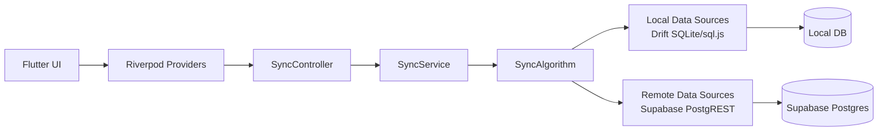
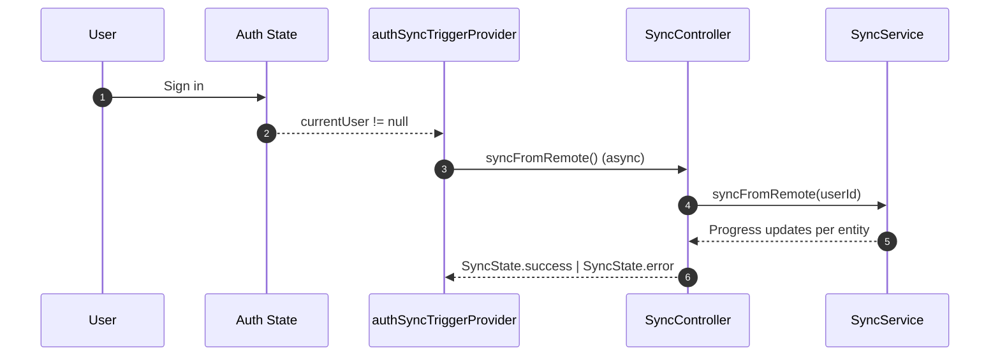
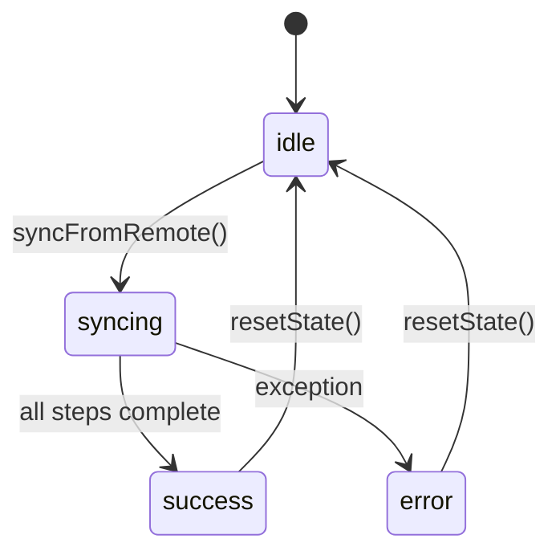
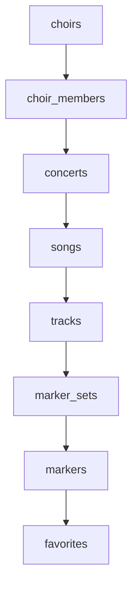
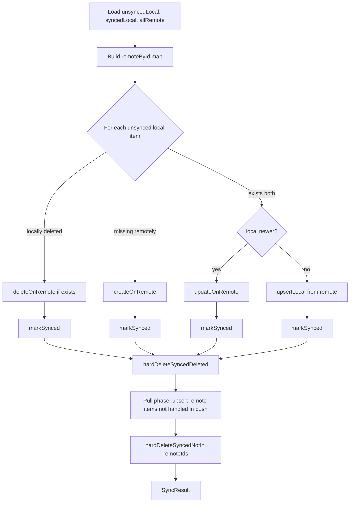
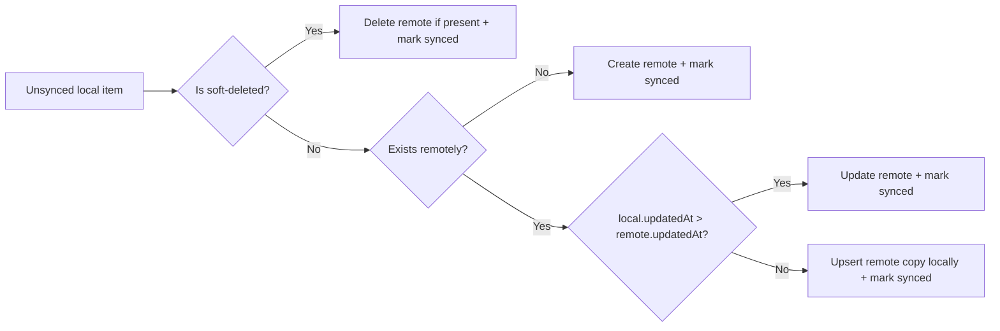
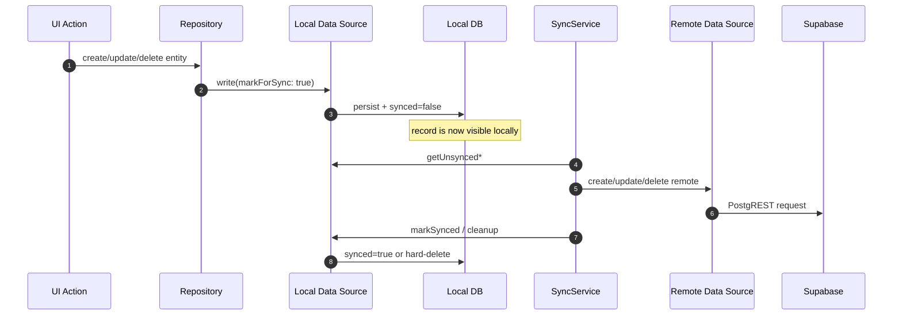
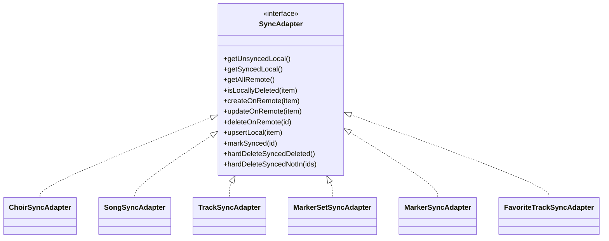

# Sync Architecture

This document describes how synchronization works in Repertoire Coach, including runtime triggers, algorithm details, entity ordering, and data movement between Flutter, local storage, and Supabase.

## Scope
- Bidirectional entity sync between local Drift DB and Supabase.
- How sync is triggered and observed in app state.
- Why entity order matters for foreign keys.

## High-Level Flow

## Trigger Points

Sync starts from one of two paths:
- Automatic trigger after sign-in (`authSyncTriggerProvider`)
- Manual trigger from UI (choir list refresh/sync action)

## Sync State Machine

## Entity Order

`SyncService` runs entities in this strict order to respect dependencies:

1. choirs
2. choir_members
3. concerts
4. songs
5. tracks
6. marker_sets
7. markers
8. favorites

Why this order:
- `concerts` depend on `choirs`
- `songs` depend on `concerts`
- `tracks` depend on `songs`
- `marker_sets` depend on `tracks`
- `markers` depend on `marker_sets`
- `favorites` depend on `tracks` and `songs`

## Generic Algorithm (Push-Before-Pull)

The core algorithm is implemented in `lib/core/sync/sync_algorithm.dart`.

## Decision Table

## Data Flow for Local Writes

Repositories write locally first and mark records for sync. The sync layer is responsible for remote propagation.

## Adapter Responsibilities

Each sync adapter maps the generic algorithm to one entity type.

## Error Handling and Retry Behavior
- Per-item push errors are counted and logged; sync continues with other items.
- Failed items remain unsynced and are retried in the next sync cycle.
- Fatal errors abort the current entity sync and set sync state to `error`.

## Notes on Consistency
- Sync is eventual, not transactional across all entities.
- UI can show partially synced data while sync is in progress.
- Provider invalidation after successful sync refreshes key screens.

## File Map
- `lib/core/services/sync_service.dart`
- `lib/core/sync/sync_algorithm.dart`
- `lib/core/sync/adapters/*`
- `lib/presentation/providers/sync_provider.dart`
