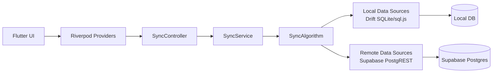
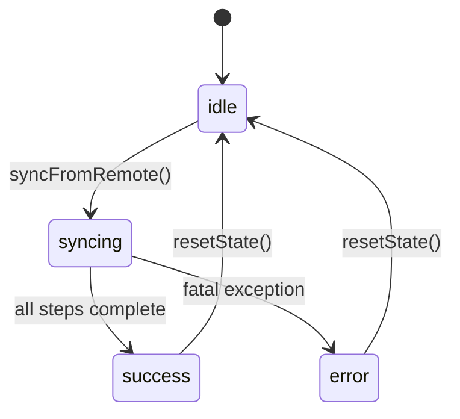
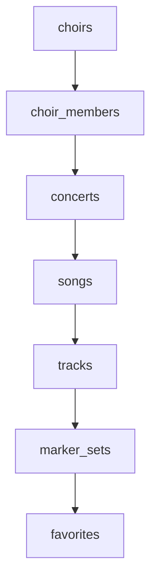
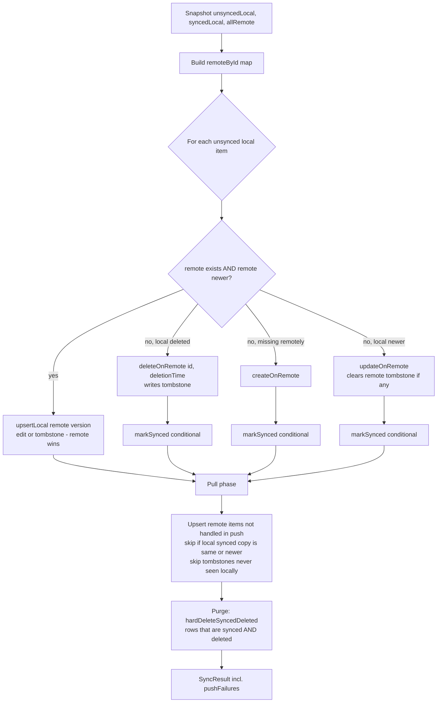
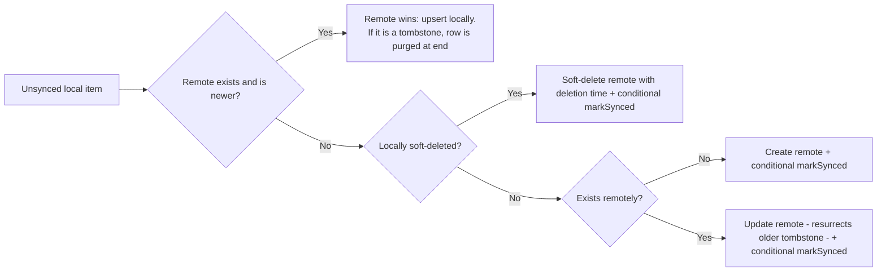
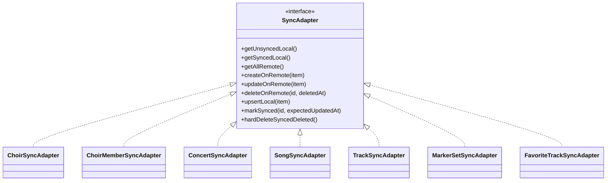

# Sync Architecture

This document describes how synchronization works in Repertoire Coach as of
**migration 013** (tombstone-based deletion, client-authoritative timestamps):
runtime triggers, the algorithm, entity ordering, invariants, and data
movement between Flutter, local storage, and Supabase.

> History: the pre-013 design synced deletions by *absence* and let the
> server stamp `updated_at` at push time. Both caused field data loss
> ("changes disappearing", "changes never arriving"). The invariants below
> exist so those properties are never accidentally reintroduced — every one
> of them has regression tests (see [Testing](#testing)).

## Scope
- Bidirectional entity sync between local Drift DB and Supabase.
- How sync is triggered and observed in app state.
- Why entity order matters for foreign keys.
- The invariants the design guarantees, and where they are enforced.

## Invariants

These are load-bearing. A change that violates one is a bug even if all
existing screens still appear to work. Each maps to named `REGRESSION:` tests.

1. **Deletion is data, never absence.** A deletion is a tombstone row
   (`deleted = true`) that syncs like any edit. A row being missing from a
   remote read means *no information* — never "it was deleted". Partial or
   empty remote reads (RLS hiccups, empty membership chains, response caps)
   must therefore be harmless.
2. **`updated_at` is the edit time**, set by the client at the moment of the
   user's action, in UTC. It is never rewritten by the server (no
   `BEFORE UPDATE` triggers on synced tables) and never stamped at push time.
   Local soft-deletes stamp their deletion time.
3. **Newest edit wins, uniformly.** Conflict resolution compares edit times
   only — including deletions in both directions: a newer edit deliberately
   overrides an older tombstone (resurrection), a newer tombstone overrides
   an older edit. This holds at *both* layers: the algorithm resolves against
   the remote snapshot it read, and the remote tombstone write is itself
   conditional (`WHERE updated_at <= deletedAt`). The second layer is what
   keeps Invariant 1 true for deletions — a degraded read that reports a row
   as absent must not let an older deletion overwrite a newer remote edit.
4. **Every "mark as synced" is conditional** on the timestamp snapshotted at
   the start of the run (`WHERE updated_at = ?`), and every pull-side upsert
   refuses to overwrite an unsynced local row that is not older than the
   incoming one. A user edit landing mid-sync therefore stays unsynced and is
   pushed on the next run — never silently dropped or overwritten.
5. **One sync run at a time per device.** `SyncController` coalesces
   overlapping triggers into a single queued follow-up run.
6. **Remote reads are complete.** All sync fetches page past PostgREST's
   `max-rows` cap and chunk `IN (...)` id lists to stay under URL limits
   (`lib/data/datasources/remote/postgrest_pagination.dart`). Paged queries
   carry a total (unique) ordering.
7. **Repositories never touch the remote.** Writes go to the local DB marked
   unsynced; the sync layer owns *all* remote I/O. (Do not reintroduce
   "inline pushes" in repositories — that dual write path was the source of
   several races.)
8. **Failures are visible.** Per-item push failures don't abort the run, but
   they are counted and surfaced in the final sync state, and the failing
   item stays unsynced for retry.

**Assumption:** device clocks are sane. Newest-wins compares client
timestamps; extreme clock skew can misresolve conflicts. (A per-device
counter as tiebreaker is a possible future hardening.)

## High-Level Flow



## Trigger Points and Reentrancy

Sync starts after sign-in (`authSyncTriggerProvider`), on several screens'
load, and from manual refresh actions. Because triggers are plentiful,
`SyncController.syncFromRemote()` guards reentrancy: if a run is in flight,
the request sets a "queued" flag and returns; one follow-up run executes when
the current one finishes. Overlapping runs previously raced on stale
snapshots (duplicate remote creates, cleanup against out-of-date state).

## Sync State Machine



The `success` state's message reports per-item push failures when there are
any ("N change(s) could not be uploaded and will be retried") — success of
the *run* does not imply every item is synced.

## Entity Order

`SyncService` runs entities in strict FK-dependency order:

1. choirs
2. choir_members
3. concerts
4. songs
5. tracks
6. marker_sets
7. favorites



Markers are not a separate step: they live inside
`marker_sets.markers_json`, so the marker set is the unit of sync (and of
conflict — concurrent edits to different markers of the same set resolve
whole-set, newest wins).

## Generic Algorithm (Push-Before-Pull, Tombstones)

Implemented in `lib/core/sync/sync_algorithm.dart`.



Key differences from the pre-013 design:
- No `hardDeleteSyncedNotIn`: nothing is ever deleted because it was absent
  from a remote read.
- `deleteOnRemote(id, deletedAt)` performs an UPDATE (`deleted = true`,
  `updated_at = deletedAt`) — remote rows are never hard-deleted by sync.
  The UPDATE carries `.lte('updated_at', deletedAt)` so it is itself a
  newest-wins write (see Invariant 3): a tombstone can never clobber a
  newer remote edit, even when the sync run's remote read was degraded and
  reported the row as absent.
- Tombstones are purged locally only once fully applied on both sides
  (synced AND deleted), at the end of the run.

## Decision Table



## Data Flow for Local Writes

Repositories write locally only and mark records for sync (Invariant 7).

```mermaid
sequenceDiagram
  autonumber
  participant UI as UI Action
  participant Repo as Repository
  participant LDS as Local Data Source
  participant DB as Local DB
  participant Sync as SyncService
  participant RDS as Remote Data Source
  participant SB as Supabase

  UI->>Repo: create/update/delete entity
  Repo->>LDS: write(markForSync: true)
  LDS->>DB: persist, synced=false, updated_at=now (UTC)
  Note over DB: record (or tombstone) is now visible locally

  Sync->>LDS: getUnsynced*
  Sync->>RDS: create/update/soft-delete remote (paged reads)
  RDS->>SB: PostgREST requests
  Sync->>LDS: conditional markSynced / upsert pulls
  LDS->>DB: synced=true; purge applied tombstones
```

## Adapter Responsibilities

Each sync adapter maps the generic algorithm to one entity type. Items expose
`syncId`, `syncTimestamp`, and `isDeleted` via the `Syncable` mixin.



`RemoteMarkerDataSource` recomputes `is_time_synced` from the payload on
every push, so the `marker_sets_is_time_synced_matches_payload` CHECK
constraint (migration 012) can never permanently reject a sync push.

## Error Handling and Retry Behavior
- Per-item push errors are counted, logged, and surfaced in the final sync
  state; sync continues with other items.
- Failed items remain unsynced and are retried in the next sync cycle. Their
  ids are excluded from the pull phase so remote data cannot overwrite a
  change that could not be uploaded.
- Fatal errors abort the current entity sync and set sync state to `error`.

## Notes on Consistency
- Sync is eventual, not transactional across entities.
- UI can show partially synced data while sync is in progress.
- Conflict granularity for markers is the whole marker set (see Entity
  Order).
- Provider invalidation after successful sync refreshes key screens.

## Testing

Three complementary suites guard this design (see also
`TESTING_GUIDELINES.md`, "Sync Testing"):
- `test/core/sync/sync_algorithm_test.dart` — deterministic `REGRESSION:`
  tests, one per historical failure mode.
- `test/core/sync/multi_device_sync_property_test.dart` — model checker:
  N devices, one shared remote, randomized interleavings with degraded
  syncs; asserts convergence and "no acknowledged write is ever lost".
- `test/integration/supabase_sync_integration_test.dart` — runs the real
  remote datasources against a local Supabase stack (`supabase start`):
  schema drift, timestamp authority, CHECK constraint on the sync path,
  tombstone round-trips, RLS visibility, >1000-row pagination.

## File Map
- `lib/core/services/sync_service.dart`
- `lib/core/sync/sync_algorithm.dart`
- `lib/core/sync/syncable.dart`
- `lib/core/sync/adapters/*`
- `lib/data/datasources/remote/postgrest_pagination.dart`
- `lib/presentation/providers/sync_provider.dart`
- `supabase/migrations/013_sync_tombstones_and_client_timestamps.sql`
